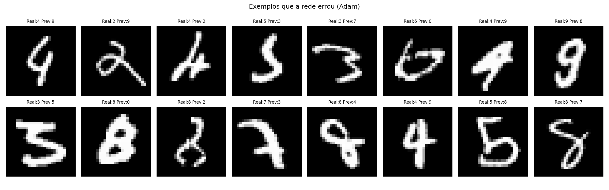

# MLP do Zero — Classificação MNIST

Implementação de um Multi-Layer Perceptron (MLP) do zero usando **apenas NumPy**, sem frameworks de deep learning. Treinado no dataset MNIST com três configurações experimentais, atingindo até **98.10%** de acurácia no conjunto de teste.

---

## Como Rodar

### Pré-requisitos

- Python 3.9+
- Git

### Setup

```bash
# Clone o repositório
git clone https://github.com/<seu-usuario>/mlp.git
cd mlp

# Crie e ative o ambiente virtual
python -m venv .venv
.venv\Scripts\activate      # Windows
# source .venv/bin/activate  # Linux/Mac

# Instale dependências
pip install -r requirements.txt

# Rode os testes unitários
pytest tests/ -v
```

### Treinar o modelo localmente

```bash
python train.py
```

### Notebooks de experimento

Os notebooks foram desenvolvidos e executados no **Google Colab** para aproveitar a GPU e evitar limitações de memória local. Para reproduzir:

1. Acesse [Google Colab](https://colab.research.google.com)
2. Faça upload do arquivo `notebooks/experimentos.ipynb`
3. Execute todas as células em ordem (Runtime → Run all)

---

## Estrutura do Projeto

```
mlp/
├── mlp/
│   ├── __init__.py         # Exporta MLP, SGD, Adam e funções auxiliares
│   ├── activations.py      # ReLU, relu_derivative, Softmax
│   ├── losses.py           # Cross-Entropy loss e derivada
│   ├── network.py          # Classe MLP (forward, backward, train, predict)
│   └── optimizers.py       # SGD e Adam
├── notebooks/
│   └── experimentos.ipynb  # 3 experimentos + visualizações + gradient check
├── results/
│   ├── loss_accuracy.png   # Curvas de loss e acurácia SGD vs Adam
│   ├── confusion_matrix.png
│   ├── tsne.png
│   └── erros.png           # Exemplos de classificações erradas
├── tests/
│   └── test_activations.py # 7 testes unitários (pytest)
├── train.py                # Script standalone de treino
└── requirements.txt
```

---

## Arquitetura e Implementação

### Design da rede

A rede aceita um número arbitrário de camadas via `layer_sizes`. Internamente:

- Cada camada oculta aplica **ReLU** na saída
- A camada de saída aplica **Softmax** para produzir distribuição de probabilidade sobre 10 classes
- A loss usada é **Cross-Entropy**

```
Entrada (784) → Camada Oculta 1 (ReLU) → Camada Oculta 2 (ReLU) → Saída (10, Softmax)
```

### Inicialização de pesos (He)

```python
w = np.random.randn(fan_in, fan_out) * np.sqrt(2.0 / fan_in)
b = np.zeros((1, fan_out))
```

A inicialização He escala os pesos pelo número de entradas da camada. Isso mantém a variância do gradiente estável durante o backpropagation em redes com ReLU — evita que os gradientes explodam ou desapareçam nas primeiras épocas. Zeros para bias é padrão: não quebra simetria (os pesos já fazem isso) e parte de um estado neutro.

### Forward pass

```
z = X @ W + b         # combinação linear
a = relu(z)           # ativação (exceto última camada)
ŷ = softmax(z_out)    # probabilidades de saída
```

O Softmax usa subtração do máximo por linha (`z - max(z)`) para estabilidade numérica — evita `exp()` de números muito grandes que resultariam em `inf`.

### Backpropagation

O gradiente percorre a rede de trás para frente usando a regra da cadeia:

```
δ_saída = ∂L/∂ŷ                  # derivada da Cross-Entropy + Softmax
dW[i]   = a[i].T @ δ             # gradiente do peso
dB[i]   = sum(δ)                 # gradiente do bias
δ_prev  = δ @ W[i].T * relu'(z)  # propaga para camada anterior
```

A derivada da Cross-Entropy combinada com Softmax simplifica para `ŷ - y_one_hot`, o que torna o cálculo eficiente.

### Otimizadores

**SGD** atualiza os pesos diretamente pelo gradiente:

```
W = W - lr * dW
```

**Adam** mantém médias móveis do gradiente (m) e do gradiente ao quadrado (v), e corrige o viés dos primeiros passos (quando m e v estão inicializados em zero):

```
m = β1 * m + (1 - β1) * dW
v = β2 * v + (1 - β2) * dW²
m̂ = m / (1 - β1^t)            # correção de viés
v̂ = v / (1 - β2^t)
W = W - lr * m̂ / (√v̂ + ε)
```

Isso cria um **learning rate adaptativo por peso** — parâmetros com gradientes grandes recebem passos menores, e vice-versa. Na prática, Adam converge muito mais rápido que SGD puro.

---

## Resultados

| Configuração | Arquitetura | Acurácia (teste) | Épocas |
|---|---|---|---|
| SGD, lr=0.01 | 784→256→128→10 | 96.66% | 20 |
| Adam, lr=0.001 | 784→256→128→10 | 98.10% | 20 |
| Adam deep, lr=0.001 | 784→512→256→128→10 | 98.03% | 20 |

### Análise dos resultados

A diferença entre SGD e Adam é notável já na primeira época: SGD começa em ~89.5% de acurácia no treino, enquanto Adam já abre com ~96.9%. Isso reflete o efeito do learning rate adaptativo — Adam aprende mais rápido porque os pesos que precisam de ajuste maior recebem passos maiores no início, quando as médias móveis ainda estão se calibrando.

Adam também é menos sensível à escolha do learning rate. SGD com lr=0.01 funciona bem, mas precisaria de tuning cuidadoso para valores muito diferentes.

### Erros mais frequentes (Adam, conjunto de teste)

A matriz de confusão revela os pares de dígitos mais difíceis para a rede:

- **8 confundido com 3**: 18 casos — ambos têm curvas fechadas
- **4 confundido com 9**: 16 casos — estrutura vertical similar
- **7 confundido com 1**: alguns casos — traço fino na diagonal

Esses erros fazem sentido visualmente: são dígitos que compartilham traços estruturais e a distinção depende de detalhes finos que o MNIST, com resolução 28×28, nem sempre captura.

---

## Visualizações

### Curvas de Loss e Acurácia

Comparação direta entre SGD e Adam ao longo das 20 épocas no conjunto de treino.


### Matriz de Confusão

Mostra exatamente quais dígitos são confundidos pela rede (Adam, conjunto de teste).


### t-SNE das Ativações Internas

Redução das ativações da penúltima camada (128 neurônios) para 2 dimensões usando t-SNE, aplicada em 2000 exemplos do conjunto de teste. Clusters bem separados indicam que a rede aprendeu representações internas distintas para cada classe — mesmo sem supervisão explícita, os neurônios internos "organizam" os dígitos de forma separável.


### Exemplos de Erros

16 imagens classificadas incorretamente pela rede. Exibe o rótulo real vs. o que a rede previu — útil para entender quais padrões visuais a rede ainda confunde.



---

## Gradient Check

O gradient check valida que o backpropagation está correto comparando o gradiente analítico com uma aproximação numérica via diferenças finitas:

```
grad_numérico ≈ [L(w + ε) - L(w - ε)] / (2ε)
```

Se a diferença relativa for menor que 1e-5, o gradiente está correto.

**Resultado nos 4 pontos testados (entrada aleatória):**

```
[0,0]    analítico=0.042804  | numérico=0.042804  | diff=9.87e-11 ✅
[1,5]    analítico=-0.022849 | numérico=-0.022849 | diff=3.41e-10 ✅
[10,15]  analítico=-0.046879 | numérico=-0.046879 | diff=1.71e-10 ✅
[100,20] analítico=-0.026399 | numérico=-0.026399 | diff=2.60e-10 ✅
```

> **Nota:** O gradient check inicial com dados reais do MNIST retornava `0.00000000` para ambos os gradientes. Isso não é bug — pixels do MNIST são frequentemente zero (fundo preto), e ReLU zera gradientes onde a entrada é ≤ 0. A solução foi usar entradas aleatórias (`np.random.randn`), que ativam mais neurônios e produzem gradientes não-triviais para verificação real.

---

## Decisões Técnicas

### Por que apenas NumPy?

O objetivo do projeto é entender o que acontece "por baixo do capô" em frameworks como PyTorch ou TensorFlow. Implementar tudo manualmente força a compreender cada etapa: multiplicação matricial no forward pass, regra da cadeia no backward, atualização de pesos no otimizador. Com um framework, esses detalhes ficam ocultos por abstrações.

### Por que ReLU e não Sigmoid/Tanh?

Sigmoid e Tanh sofrem do problema de **vanishing gradient**: nas regiões de saturação (valores extremos), a derivada fica próxima de zero, e o gradiente mal chega às primeiras camadas em redes mais profundas. ReLU não tem esse problema — sua derivada é exatamente 1 para valores positivos, o gradiente flui sem atenuação. É o padrão moderno para redes feedforward.

### Por que Softmax + Cross-Entropy?

Para classificação multiclasse, Softmax converte a saída da rede em probabilidades que somam 1. Cross-Entropy penaliza proporcionalmente ao logaritmo da probabilidade atribuída à classe correta — quando a rede está muito errada, a penalidade é alta. Juntas, a derivada simplifica para `ŷ - y_true`, o que é computacionalmente elegante e numericamente estável.

### Por que mini-batch e não batch completo ou SGD puro?

- **Batch completo** é lento e fica preso em mínimos locais mais facilmente
- **SGD puro (batch=1)** é muito ruidoso — gradiente de um único exemplo não representa bem a direção geral
- **Mini-batch** equilibra os dois: calcula gradiente sobre um subconjunto representativo, aproveita operações matriciais vetorizadas, e o ruído ajuda a escapar de mínimos locais ruins

Batch size 64 é uma escolha padrão que funciona bem para MNIST.

### Por que embaralhar os dados a cada época?

Sem embaralhamento, a rede vê sempre os mesmos exemplos na mesma ordem. Isso pode criar dependências artificiais — a rede "aprende" a sequência dos dados em vez de generalizar o conteúdo. `np.random.permutation` garante que cada época seja essencialmente um novo sorteio.

### Arquitetura 784→256→128→10

Escolhida como ponto de partida equilibrado: grande o suficiente para aprender padrões complexos do MNIST, pequeno o suficiente para treinar rápido sem GPU. A diminuição progressiva de neurônios (256→128) força a rede a criar representações cada vez mais comprimidas e abstratas. O experimento 3 testa uma variante mais profunda (784→512→256→128→10) para verificar se camadas adicionais melhoram a acurácia.

---

## Dificuldades e Aprendizados

### Inicialização dos pesos

A primeira tentativa usou zeros para todos os pesos. A rede não aprendia nada: todos os neurônios da mesma camada recebiam o mesmo gradiente e evoluíam de forma idêntica — o problema da simetria. Com pesos aleatórios sem escala adequada, os gradientes explodiam. A inicialização He resolve isso matematicamente, projetada especificamente para ReLU.

**Aprendizado:** inicialização não é detalhe — é pré-requisito para o aprendizado funcionar.

### VSCode reiniciou e desligou o autosave

Durante o desenvolvimento, o VSCode atualizou e reiniciou automaticamente, desligando o autosave sem aviso. Os arquivos `.py` ficaram em disco com conteúdo vazio — o que estava na memória do editor nunca foi salvo. Vários commits foram feitos com arquivos vazios antes de o problema ser identificado.

**Diagnóstico:** `Get-Content arquivo.py | Select-Object -First 5` no PowerShell mostrou os arquivos vazios.  
**Solução:** reabrir cada arquivo no editor, forçar Ctrl+S, verificar com `git diff` e recommitar com a mensagem `fix: salva conteúdo real dos arquivos (autosave estava desligado)`.  
**Aprendizado:** sempre verificar `git diff` antes de commitar. Nunca assumir que o que está na tela já foi salvo em disco.


### Gradient check retornando zeros com dados reais

O gradient check inicial usava os primeiros 16 exemplos do MNIST. O resultado foi `analítico=0.00000000 | numérico=0.00000000` — tecnicamente "correto" (diferença relativa = 0) mas inútil para validação. O problema: muitos pixels do MNIST são zero (fundo preto), o que faz ReLU zerar os gradientes ao longo de toda a rede para aquelas entradas.

**Solução:** usar `np.random.randn(16, 784)` — valores gaussianos garantem que a maioria dos neurônios fique ativa e o gradiente seja não-trivial.

### SyntaxError: f-string com quebra de linha literal

Em uma edição do notebook, um `\n` que deveria ser caractere de escape ficou como quebra de linha literal dentro de um f-string, causando `SyntaxError: unterminated f-string literal`. O erro aparecia no Colab mas não era visível no editor porque a célula exibia a string com a quebra visual como se fosse correta.

**Solução:** corrigir via Python no arquivo `.ipynb` (substituição no JSON) antes do upload para o Colab.

---

## Testes Unitários

```bash
pytest tests/ -v
```

Cobertura atual — 7 testes em `tests/test_activations.py`:

- `test_relu_positive` — valores positivos passam sem mudança
- `test_relu_negative` — valores negativos viram zero
- `test_relu_zero` — zero retorna zero
- `test_relu_derivative_positive` — retorna 1 para positivos
- `test_relu_derivative_negative` — retorna 0 para negativos
- `test_softmax_sum_to_one` — saída soma 1 por linha
- `test_softmax_shape` — shape de saída igual ao de entrada
