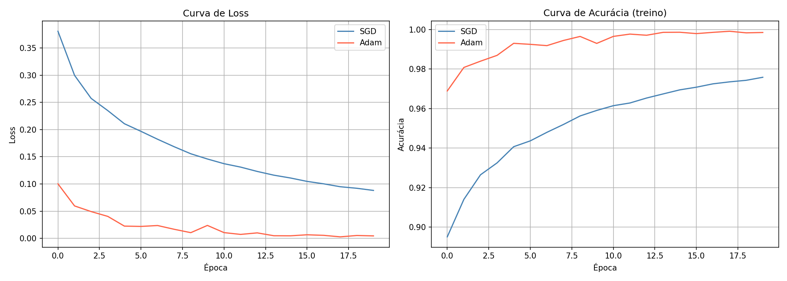
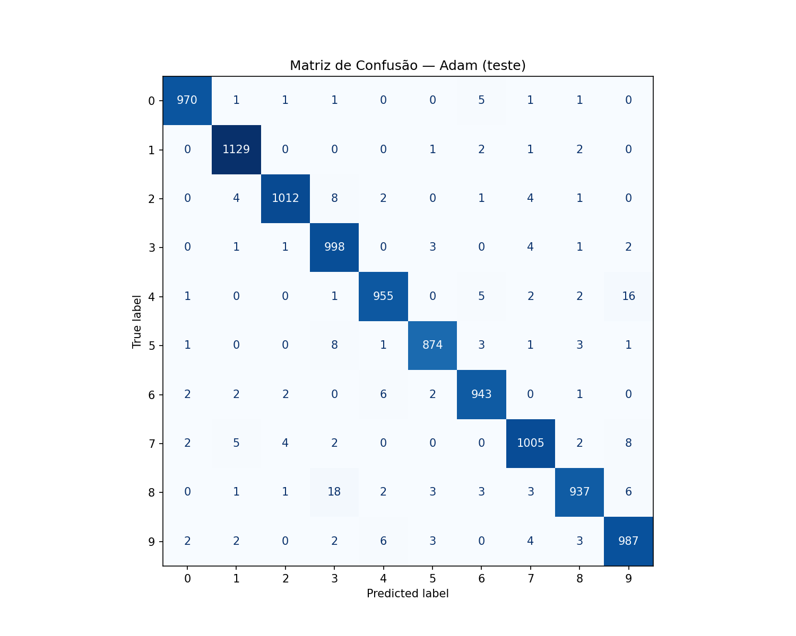
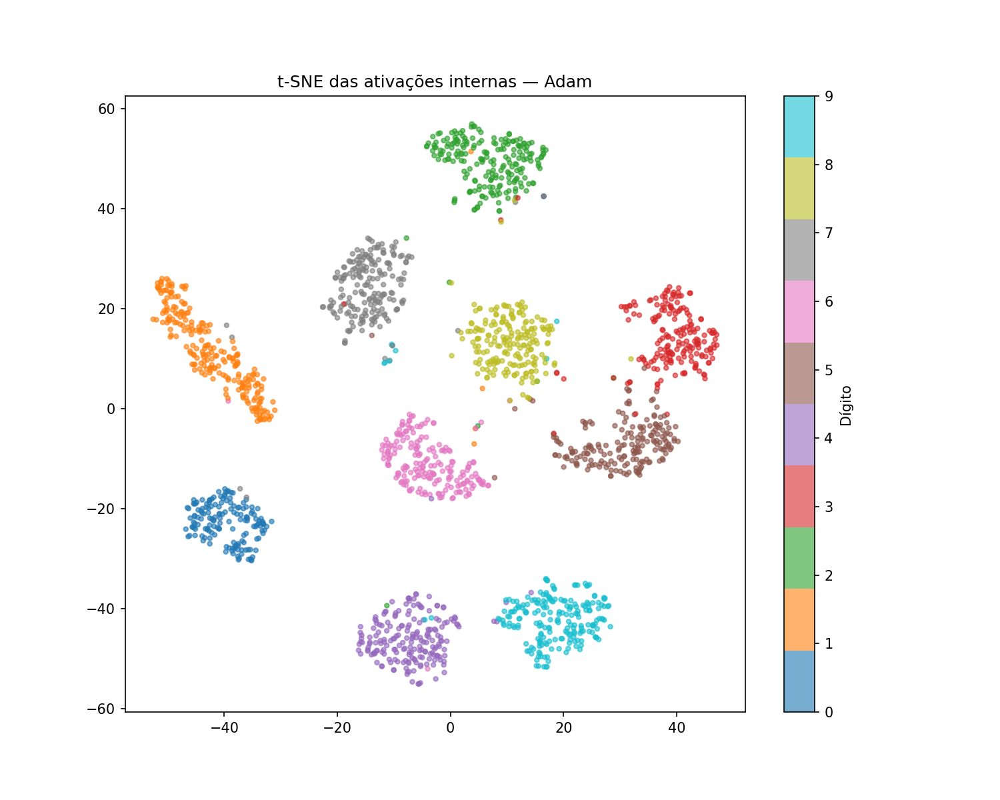

# MLP do Zero — MNIST

## Como Rodar

```bash
python -m venv .venv
.venv\Scripts\activate  # Windows
pip install -r requirements.txt
pytest tests/
```

## Arquitetura Escolhida

- **Camadas:** 784 → 256 → 128 → 10
- **Ativação ocultas:** ReLU
- **Ativação saída:** Softmax
- **Loss:** Cross-Entropy
- **Otimizadores:** SGD (lr=0.01) e Adam (lr=0.001)

Escolhi 2 camadas ocultas com 256 e 128 neurônios porque é uma arquitetura equilibrada para o MNIST — grande o suficiente para aprender os padrões, mas sem ser excessivamente pesada.

## Resultados

| Configuração | Arquitetura | Acurácia (teste) | Épocas |
|---|---|---|---|
| SGD, lr=0.01 | 784→256→128→10 | 96.66% | 20 |
| Adam, lr=0.001 | 784→256→128→10 | 98.10% | 20 |
| Adam deep, lr=0.001 | 784→512→256→128→10 | — | 20 |

Adam convergiu muito mais rápido — já na época 1 tinha 96.89% de acurácia no treino, enquanto SGD começou em 89.51%. O experimento com arquitetura mais profunda testa se mais camadas melhoram o resultado.






## Decisões e Dificuldades

**Decisão técnica mais difícil:**
A inicialização dos pesos. Inicialmente tentei zeros, mas a rede não aprendia nada — todos os neurônios evoluíam igual porque os gradientes eram simétricos. Mudei para inicialização He, que é adequada para ReLU, e a rede passou a aprender normalmente.

**O que não funcionou:**
Durante o desenvolvimento, o VSCode reiniciou inesperadamente e desligou o autosave sem eu perceber. Fiz vários commits com arquivos vazios antes de notar que nada tinha sido salvo em disco. Aprendi a sempre verificar com `git diff` antes de commitar e a manter o autosave ativo.

Na matriz, o dígito 8 foi confundido com 3 em 18 casos, e o 4 com 9 em 16 casos 

**Se fosse refazer:**
Implementaria o gradient check desde o início do desenvolvimento, não só no final. Teria me poupado de dúvidas sobre se o backpropagation estava correto durante o treino.